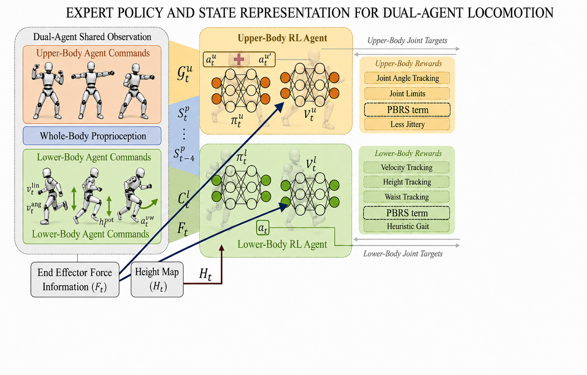

# DecoupledLoco-Manipulation: Resolving Reward Interference via Constrained RL andPotential-Based Reward Shaping

This repository provides custom IsaacLab configuration files for Digit loco-manipulation experiments. Users should install IsaacLab separately, then copy these files into the corresponding IsaacLab task directory.

Tested with IsaacLab `2.3.0`.

## Demo Videos
[Baseline]

[falcon.webm](https://github.com/user-attachments/assets/e05a979d-8388-4121-9ee9-96f74660f2c4)

[DRS]

[drs.webm](https://github.com/user-attachments/assets/58344c5d-0187-4406-894a-092de1558d91)

[PBRS]

[pbrs.webm](https://github.com/user-attachments/assets/3bb90684-fa6d-433e-97d0-fd9c1f4ae993)


## Architecture



## Files

Copy the following files into the same paths inside your IsaacLab repository:

```text
source/isaaclab_tasks/isaaclab_tasks/manager_based/locomanipulation/tracking/config/digit/agents/rsl_rl_ppo_cfg.py
source/isaaclab_tasks/isaaclab_tasks/manager_based/locomanipulation/tracking/config/digit/loco_manip_env_cfg_force.py
source/isaaclab_tasks/isaaclab_tasks/manager_based/locomanipulation/tracking/config/digit/loco_manip_env_cfg_ovx.py
source/isaaclab_tasks/isaaclab_tasks/manager_based/locomanipulation/tracking/config/digit/pbrs_loco_manip_env_cfg.py
```

## Setup

Install IsaacLab first:

```bash
git clone https://github.com/isaac-sim/IsaacLab.git
cd IsaacLab
git checkout v2.3.0
```

Follow the official IsaacLab installation guide, then verify the installation:

```bash
./isaaclab.sh -p scripts/reinforcement_learning/rsl_rl/train.py --help
```

Set your IsaacLab path:

```bash
export ISAACLAB_ROOT=/path/to/IsaacLab
```

Copy the custom config files:

```bash
cp -r source/isaaclab_tasks "$ISAACLAB_ROOT/source/"
```

## Register Tasks

Add the following registration snippet to:

```text
$ISAACLAB_ROOT/source/isaaclab_tasks/isaaclab_tasks/manager_based/locomanipulation/tracking/config/digit/__init__.py
```

Make sure the file imports `gymnasium` and `agents`:

```python
import gymnasium as gym

from . import agents
```

Then append:

```python
_TASKS = [
    (
        "Isaac-Tracking-LocoManip-Force-Digit-v0",
        "isaaclab.envs:ManagerBasedRLEnv",
        "loco_manip_env_cfg_force:DigitLocoManipForceEnvCfg",
        "DigitLocoManipPPORunnerCfg",
    ),
    (
        "Isaac-Tracking-LocoManip-Force-Digit-Play-v0",
        "isaaclab.envs:ManagerBasedRLEnv",
        "loco_manip_env_cfg_force:DigitLocoManipForceEnvCfg_PLAY",
        "DigitLocoManipPPORunnerCfg",
    ),
    (
        "Isaac-Tracking-LocoManip-Rough-Digit-v0",
        "isaaclab.envs:ManagerBasedRLEnv",
        "loco_manip_env_cfg_ovx:DigitRoughLocoManipEnvCfg",
        "DigitRoughLocoManipPPORunnerCfg",
    ),
    (
        "Isaac-Tracking-LocoManip-Rough-Digit-Play-v0",
        "isaaclab.envs:ManagerBasedRLEnv",
        "loco_manip_env_cfg_ovx:DigitRoughLocoManipEnvCfg_PLAY",
        "DigitRoughLocoManipPPORunnerCfg",
    ),
    (
        "Isaac-Tracking-LocoManip-PBRS-Digit-v0",
        f"{__name__}.pbrs_loco_manip_env_cfg:PbrsManagerBasedRLEnv",
        "pbrs_loco_manip_env_cfg:DigitPbrsLocoManipEnvCfg",
        "DigitLocoManipPPORunnerCfg",
    ),
    (
        "Isaac-Tracking-LocoManip-PBRS-Digit-Play-v0",
        f"{__name__}.pbrs_loco_manip_env_cfg:PbrsManagerBasedRLEnv",
        "pbrs_loco_manip_env_cfg:DigitPbrsLocoManipEnvCfg_PLAY",
        "DigitLocoManipPPORunnerCfg",
    ),
    (
        "Isaac-Tracking-LocoManip-PBRS-Rough-Digit-v0",
        f"{__name__}.pbrs_loco_manip_env_cfg:PbrsManagerBasedRLEnv",
        "pbrs_loco_manip_env_cfg:DigitPbrsRoughLocoManipEnvCfg",
        "DigitRoughLocoManipPPORunnerCfg",
    ),
    (
        "Isaac-Tracking-LocoManip-PBRS-Rough-Digit-Play-v0",
        f"{__name__}.pbrs_loco_manip_env_cfg:PbrsManagerBasedRLEnv",
        "pbrs_loco_manip_env_cfg:DigitPbrsRoughLocoManipEnvCfg_PLAY",
        "DigitRoughLocoManipPPORunnerCfg",
    ),
]

for task_id, entry_point, env_cfg, runner_cfg in _TASKS:
    gym.register(
        id=task_id,
        entry_point=entry_point,
        disable_env_checker=True,
        kwargs={
            "env_cfg_entry_point": f"{__name__}.{env_cfg}",
            "rsl_rl_cfg_entry_point": f"{agents.__name__}.rsl_rl_ppo_cfg:{runner_cfg}",
        },
    )
```

## Run

Smoke test:

```bash
cd "$ISAACLAB_ROOT"

./isaaclab.sh -p scripts/reinforcement_learning/rsl_rl/train.py \
  --task Isaac-Tracking-LocoManip-PBRS-Digit-v0 \
  --num_envs 16 \
  --max_iterations 2 \
  --headless
```

Train PBRS:

```bash
./isaaclab.sh -p scripts/reinforcement_learning/rsl_rl/train.py \
  --task Isaac-Tracking-LocoManip-PBRS-Digit-v0 \
  --num_envs 4096 \
  --headless
```

Train rough-terrain PBRS:

```bash
./isaaclab.sh -p scripts/reinforcement_learning/rsl_rl/train.py \
  --task Isaac-Tracking-LocoManip-PBRS-Rough-Digit-v0 \
  --num_envs 4096 \
  --headless
```

Play:

```bash
./isaaclab.sh -p scripts/reinforcement_learning/rsl_rl/play.py \
  --task Isaac-Tracking-LocoManip-PBRS-Digit-Play-v0 \
  --num_envs 50
```

## Notes

- Training logs are saved under `logs/rsl_rl/` in IsaacLab.
- If a task ID cannot be found, check the `digit/__init__.py` registration.
- If imports fail, confirm that your IsaacLab version provides the Digit / Agility robot assets used by these configs.
